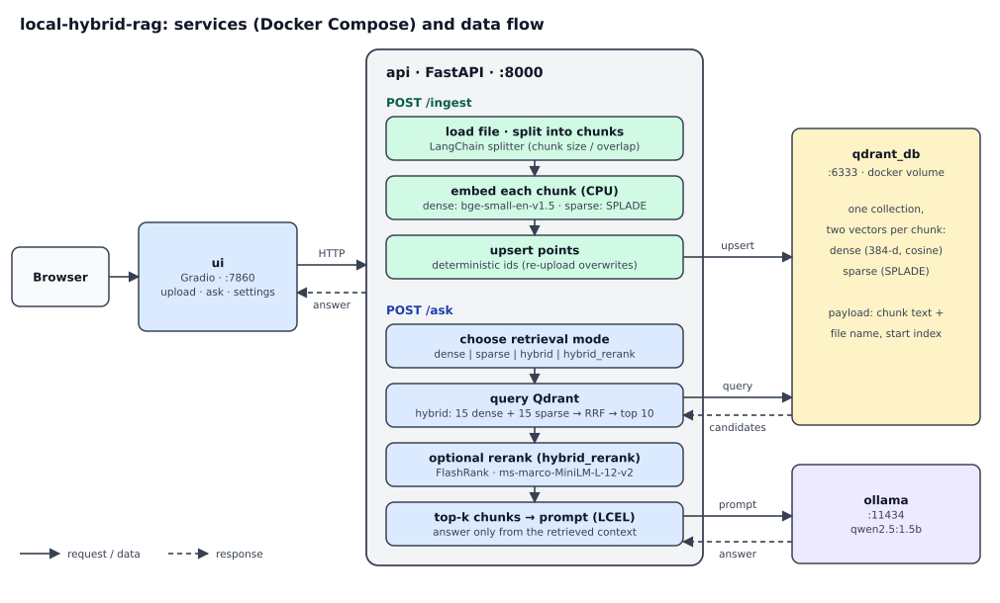

# Local Hybrid-Search RAG

A local Retrieval-Augmented Generation (RAG) system built as a learning project, plus a small experiment that measures what each retrieval stage actually contributes.

Documents are split into chunks and indexed in Qdrant with two vectors per chunk (dense and sparse). A query can be answered with dense, sparse, hybrid (Reciprocal Rank Fusion) or hybrid + cross-encoder reranking retrieval, and the retrieved chunks are given to a small LLM served locally by Ollama. Everything runs on your machine with Docker Compose.

**Main findings of the evaluation** (details and caveats [below](#evaluation)):
- On keyword-style queries, sparse retrieval alone was the best; fusing it with dense results lowered MRR.
- On paraphrased questions, dense, sparse and hybrid retrieval are within sampling noise of each other (60 queries).
- The reranker only reorders the 10 fused candidates: it cannot raise recall@10, it gave a small MRR gain I cannot confirm with this sample size, and it multiplies latency by roughly 10.



## How it works

```
question
   |-- dense vector  (BAAI/bge-small-en-v1.5)     top 15 --.
   |-- sparse vector (prithivida/Splade_PP_en_v1) top 15 --+-- Reciprocal Rank Fusion --> top 10
                                                                       |
                         (optional) cross-encoder rerank (FlashRank, ms-marco-MiniLM-L-12-v2)
                                                                       |
                                                    top 5 chunks --> prompt --> Qwen2.5 1.5B (Ollama)
```

Four retrieval modes can be chosen per query from the UI or the API: `dense`, `sparse`, `hybrid`, `hybrid_rerank`. The limits above are the defaults and are adjustable (prefetch limit, RRF limit, top-k).

| Container | Role |
|---|---|
| `ui` | Gradio app (port 7860): upload one `.txt` file with chunk size / overlap sliders, ask questions, choose the retrieval mode and limits |
| `api` | FastAPI (port 8000): `POST /ingest`, `POST /ask`, Swagger UI at `/docs`; requests validated with Pydantic |
| `qdrant_db` | Qdrant vector database (ports 6333/6334), data kept in a Docker volume |
| `ollama` | Serves `qwen2.5:1.5b` (pulled at container start) |

Implementation notes:
- Chunking: LangChain `RecursiveCharacterTextSplitter` (UI defaults: 1000 characters, 200 overlap).
- Ingestion is idempotent for the same file name and chunking parameters: point ids are deterministic (`uuid5` of path, start index, chunk size and overlap), so re-uploading overwrites instead of duplicating.
- Generation uses a LangChain (LCEL) chain; the system prompt asks the model to answer only from the retrieved context (temperature 0.2).

## Run it

Requirements: Docker with Docker Compose. The compose file reserves an NVIDIA GPU for the `ollama` container, so it needs the [NVIDIA Container Toolkit](https://docs.nvidia.com/datacenter/cloud-native/container-toolkit/latest/install-guide.html); on a machine without a GPU the `deploy:` block of the `ollama` service has to be removed (not tested). The embedding models and the reranker run on CPU.

```bash
git clone https://github.com/Ric03aipy/local-hybrid-rag.git
cd local-hybrid-rag
docker compose up --build
```

Open http://localhost:7860 (UI) or http://localhost:8000/docs (API). The first start downloads the LLM and the retrieval models, so it takes a while. Tested on WSL2 (Linux) with Docker.

## Evaluation

**Question.** What does each retrieval stage (dense, sparse, fusion, reranking) contribute, and at what latency cost?

**Setup**
- **Corpus:** 100 Python Enhancement Proposals sampled at random (seed 42) from [`python/peps`](https://github.com/python/peps) at commit `730372f74cd1c200170478fb91a9b3f07a737acd`; the list of files is in `eval/manifest.txt`. Chunking: 1000 characters, 50 overlap, giving 2,125 chunks.
- **Queries:** 120 queries in `eval/queries.jsonl`, written by an LLM assistant from 60 sampled chunks (46 files, at most 3 chunks per file): for each chunk one `semantic` query (a paraphrased question) and one `keyword` query (short, with rare identifiers or names). Each query has exactly one correct chunk, identified by file name and start offset. `queries.jsonl` is a frozen set: it was written from an earlier export of candidate chunks (sampled with replacement, 76 distinct chunks), not from the output of the current `eval/export_chunks.py`, which draws a different sample (only 6 of the 60 chunks used by the queries appear in the committed `eval/chunks_for_questions.jsonl`).
- **Metrics:** Recall@k = fraction of queries whose correct chunk is in the top k results; MRR@k = mean of 1/rank of the correct chunk (0 if it is not in the top k). Only retrieval is evaluated (no LLM). Latency is measured per query, sequentially, including the fusion and, for `hybrid + rerank`, the reranking.
- **Hardware:** Dell XPS 15 9510 (Intel i9-11900H, 16 GB RAM), WSL2 limited to 6 processors and 8 GB, Qdrant in Docker, CPU inference for embeddings and reranker.

**Results** (60 queries per type; Recall as hits out of 60; produced by `eval/run_eval.py`, raw per-query data in `eval/raw_metrics.csv`)

Keyword queries:

| Retrieval | Recall@5 | Recall@10 | MRR@10 |
|---|---|---|---|
| dense | 56/60 | 58/60 | 0.881 |
| sparse (SPLADE) | 60/60 | 60/60 | 1.000 |
| hybrid (RRF) | 60/60 | 60/60 | 0.947 |
| hybrid + rerank | 60/60 | 60/60 | 0.975 |

Semantic (paraphrased) queries:

| Retrieval | Recall@5 | Recall@10 | MRR@10 |
|---|---|---|---|
| dense | 49/60 | 53/60 | 0.642 |
| sparse (SPLADE) | 53/60 | 53/60 | 0.667 |
| hybrid (RRF) | 53/60 | 55/60 | 0.697 |
| hybrid + rerank | 52/60 | 55/60 | 0.753 |

Latency per query (all 120 queries per mode, sequential):

| Retrieval | p50 (ms) | p95 (ms) |
|---|---|---|
| dense | 10 | 13 |
| sparse (SPLADE) | 34 | 48 |
| hybrid (RRF) | 70 | 88 |
| hybrid + rerank | 706 | 1038 |

**What the results do and do not show**
- *Keyword queries:* sparse retrieval found the correct chunk at rank 1 in all 60 cases, and dense retrieval is worse (MRR@10 0.881). RRF fusion (0.947) is below sparse alone, which suggests that the dense list dilutes a very good sparse ranking (I did not investigate further). These queries reuse rare tokens of the chunk itself, so they favour lexical matching by construction: this shows what sparse retrieval is best at, not that it is better in general.
- *Semantic queries:* MRR@10 is 0.64 (dense), 0.67 (sparse), 0.70 (hybrid). With 60 queries the 95% sampling error of a proportion like these is roughly 8-10 percentage points, so I do not claim any ranking among the three.
- *Reranking:* it reorders the same 10 candidates (the code asserts this), so recall@10 is identical to hybrid retrieval. MRR@10 rises by about 0.03-0.06, but with this sample I cannot tell whether that gain is real. The p50 latency goes from about 0.07 s to about 0.7 s on CPU.
- *Fusion can lose a result:* for query `q095`, dense retrieval ranked the correct chunk 7th, but it was not in the fused top 10.
- *Run-to-run variation:* the hybrid MRR@10 was 0.688, 0.705, 0.697 and 0.697 on semantic queries and between 0.938 and 0.947 on keyword queries in four runs on the same collection, while dense and sparse were identical across runs. A possible cause is ties in the RRF scores at the cut-off; I did not verify it. Latencies also vary between runs, so read them as orders of magnitude.
- The 5 semantic queries missed by hybrid retrieval (`q015`, `q023`, `q065`, `q095`, `q113`) were not analysed in detail.

**Reproduce**

Requirements: Docker, [uv](https://docs.astral.sh/uv/), Python >= 3.12.

```bash
git clone https://github.com/python/peps.git ../peps
git -C ../peps checkout 730372f74cd1c200170478fb91a9b3f07a737acd
docker compose up -d qdrant_db
uv sync
uv run -m eval.data_script            # copies the 100 sampled PEPs to data/
uv run -m eval.ingest_corpus          # deletes and recreates the collection, ~20 min on CPU
uv run -m eval.run_eval --regen       # writes the csv files in eval/
uv run pytest
```

Ingestion took about 20 minutes for 2,125 chunks (about 1.7 chunks/s) on the machine above. The collection used is `peps_eval`, the same one the API container reads, so the ingested PEPs can also be queried from the UI. The committed results come from a run on a fresh clone of the repository; they match the earlier runs except for small differences in the hybrid rows (see run-to-run variation) and in the latencies.

## Limitations

- **Scale:** 100 documents and 2,125 chunks. I did not test larger collections, concurrency or throughput under load.
- **Evaluation data:** queries were generated by an LLM from the chunks, not collected from users, and they share vocabulary with the correct chunk. Each query has one correct chunk; neighbouring chunks or other PEPs on the same topic can be equally valid, so recall is probably underestimated. 60 queries per type is small.
- **No generation quality evaluation:** only retrieval is measured. The LLM is a 1.5B model; answers are not checked for faithfulness to the context.
- **Ingestion:** about 1.7 chunks/s on CPU (batch size 8, not optimised). `/ingest` is a synchronous endpoint (FastAPI runs it in a thread pool), so a request stays open until the whole file is indexed. The UI accepts one `.txt` file at a time.
- **Re-ingestion:** ids depend on file name and chunking parameters. Re-ingesting a file with different chunk size or overlap leaves its old chunks in the collection.
- **Sparse vector setup:** the vector is named `bm25_sparse_vector` for historical reasons but the model is SPLADE, and it is configured with Qdrant's IDF modifier as for BM25; I did not test whether that is appropriate for SPLADE weights.
- **Reranker model:** downloaded at first use and not persisted in a Docker volume, so it is downloaded again when the `api` container is recreated.

## Repository layout

```
src/enterprise_rag/   application package (api, ui, retriever, interlocutor, qdrant_ingestion, config)
eval/                 evaluation: data sampling, ingestion, run_eval, metrics, queries.jsonl, results csv
tests/                unit tests of the metric code (recall, MRR, rank lookup, chunk keys)
Dockerfile.api, Dockerfile.ui, docker-compose.yaml
```

`eval/queries.jsonl` is the frozen evaluation set. `eval/export_chunks.py` samples candidate chunks to write queries from; its committed output, `eval/chunks_for_questions.jsonl`, does not correspond to the chunks the current queries were written from (see Evaluation). The Python package keeps its original name, `enterprise_rag`.

## Development notes

I wrote the application and the evaluation code. AI assistants were used for educational purpose: for pointers to documentation, code review, suggestions on fixes and refactoring. The evaluation queries and the first draft of this README were written by an AI assistant. Only the code that computes the metrics has unit tests; the application itself was checked manually end to end.

Possible next steps: PDF/DOCX parsing, batch ingestion of folders, an agentic endpoint on top of the retriever.
